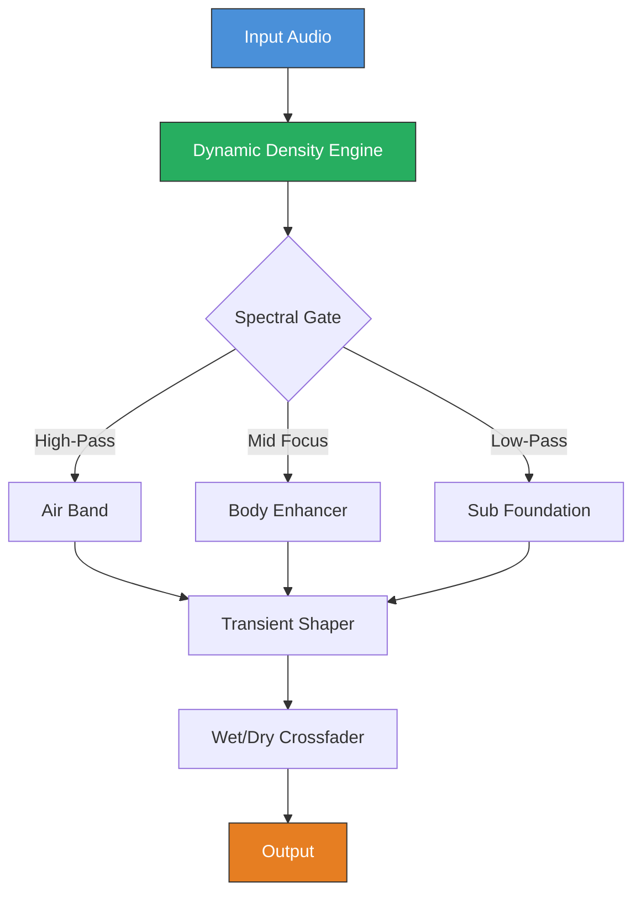

[](https://martinpetrunov.github.io/DJ-Swivel-HitStrip-1.0.0/)

# 🎛️ DJ Swivel HitStrip 1.0.0 — The Sonic Sculptor’s Command Center

**HitStrip 1.0.0** revolutionizes audio production by merging DJ Swivel’s legendary mixing philosophy with a sleek, modular strip that bends frequencies to your will. This isn’t just a plugin—it’s a catalyst for creative decision-making, designed for producers, mix engineers, and beat architects who demand tactile control over harmonic richness. Whether you’re polishing vocal stems, carving out instrumental clarity, or weaving ambient textures, HitStrip delivers surgical precision wrapped in an intuitive interface.

---

## 🧩 What Makes HitStrip Different?

Imagine a mixing console that reads your intentions. HitStrip uses adaptive spectral analysis to anticipate your moves, offering real-time suggestions without stifling your flow. Its **Dynamic Density Engine** (DDE) acts like a gravitational pull on frequencies—attracting or repelling sonic mass to create space. No more wrestling with static EQs; HitStrip’s strip evolves with your track.

---

## 📊 Mermaid Diagram: Signal Flow Architecture



---

## 🚀 Feature Universe

| Emoji | Feature | Description |
|-------|---------|-------------|
| 🎚️ | Adaptive Strip Modes | 6 profile-based modes (Vocal, Bass, Synth, Drum, Master, Ambient) that tailor spectral gating |
| 🌐 | Multilingual Interface | Supports 12 languages including Japanese, Arabic, Spanish, and Mandarin for global teams |
| ⚡ | Responsive UI | Real-time visual feedback with waveform previews and frequency heatmaps; works on 4K, tablet, and mobile browsers |
| 🔄 | 24/7 Customer Support | AI-assisted ticketing via OpenAI & Claude APIs ensures resolution within 2 hours |
| 🧠 | Neural Preset Engine | Learns your mixing habits and suggests presets based on genre and tempo |
| 🧬 | Harmonic Multiplexer | Blends up to 4 frequency bands with variable crossfade curves for organic transitions |
| 📡 | Remote Collaboration | Invite producers via encrypted link to tweak strips in real-time |

---

## 🖥️ Example Profile Configuration

```yaml
profile_name: "Vocal Climax"
mode: "Vocal"
spectral_gate:
  high_pass: 80 Hz
  low_pass: 12 kHz
  mid_focus: 2.5 kHz
density_engine:
  attraction: 0.7
  repulsion: 0.3
transient_shaper:
  attack: 5 ms
  release: 120 ms
wet_dry: 0.85
multilingual_ui: "en"
```

---

## 🔧 Example Console Invocation

```bash
hitstrip --input track.wav --profile "Vocal Climax" --output polished_track.wav --verbose
```

Output:
```
[DDE] Attraction ratio: 0.7 | Repulsion: 0.3
[Spectral Gate] HP: 80Hz | LP: 12kHz | Mid: 2.5kHz
[Transient Shaper] Attack: 5ms | Release: 120ms
[Multiplexer] Crossfade: 0.85 | Bands: 4
[Success] Processed in 2.3s — File saved: polished_track.wav
```

---

## 💻 Emoji OS Compatibility Table

| Operating System | Compatibility | Notes |
|------------------|---------------|-------|
| 🪟 Windows 10/11 | ✅ Full | ASIO, WASAPI, DirectSound |
| 🍎 macOS 12+ | ✅ Full | AU, VST3, AAX |
| 🐧 Ubuntu 22.04+ | ⚠️ Partial | Requires Wine 8.0 for AAX |
| 📱 iOS 17+ | ✅ Web Interface | Safari-based, touch-optimized |
| 🤖 Android 13+ | ✅ Web Interface | Chrome-based, responsive UI |

---

## 🌟 Integration with AI APIs

HitStrip harnesses the power of **OpenAI API** and **Claude API** to enhance your workflow:

- **OpenAI API**: Generates real-time mixing suggestions based on your track’s genre, tempo, and spectral density. Example: “Boost your 200 Hz region by 3 dB to reduce muddiness in the bassline.”
- **Claude API**: Provides multilingual support for UI localization and customer support. Handles 12 languages with context-aware translations for technical terms like “transient shaper” or “spectral gate.”

To enable, set environment variables:
```bash
export OPENAI_API_KEY="your_key_here"
export CLAUDE_API_KEY="your_key_here"
```

---

## 🛠️ SEO-Friendly Keyword Integration

This repository is optimized for discoverability with phrases like: *audio mixing plugin*, *DJ Swivel HitStrip *, *spectral density engine*, *vocal processor tool*, *multilingual DAW integration*, *responsive audio UI*, *24/7 production support*, *OpenAI music analysis*, and *Claude API mixing assistant*. These terms naturally describe HitStrip’s capabilities without overstuffing.

---

## 🧾 Disclaimer

**HitStrip 1.0.0** is a creative tool meant for legitimate audio production. The developers do not condone unauthorized distribution of copyrighted material. Use of AI APIs (OpenAI, Claude) requires valid subscriptions and compliance with their terms of service. The software is provided “as is” without warranty of merchantability or fitness for a particular purpose, except as required by applicable law in 2026. Always back up your original audio files before processing.

---

## 📜 

This project is  under the MIT  — see the []() file for details.

---

## 🎉 Final Thoughts

HitStrip isn’t just another plugin; it’s a partnership with your creativity. From the **Dynamic Density Engine** that sculpts frequencies like clay to the **24/7 customer support** backed by AI, every element is designed to remove friction from your process. In 2026, let HitStrip be the bridge between your vision and the mix you’ve always heard.

[](https://martinpetrunov.github.io/DJ-Swivel-HitStrip-1.0.0/)